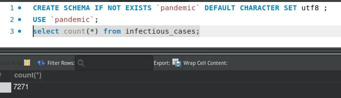
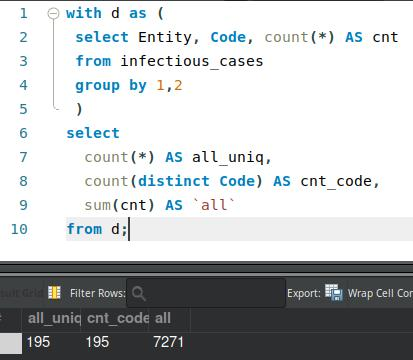
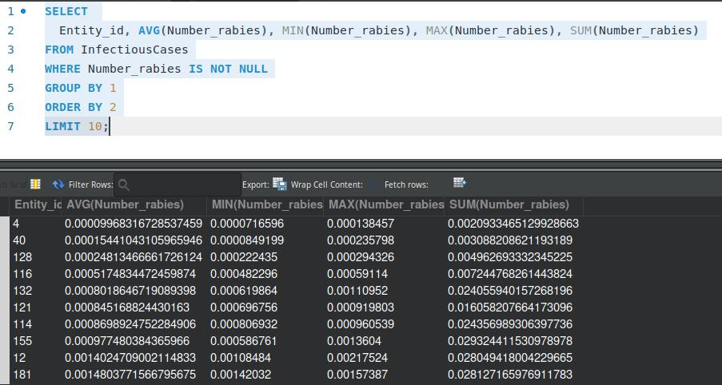
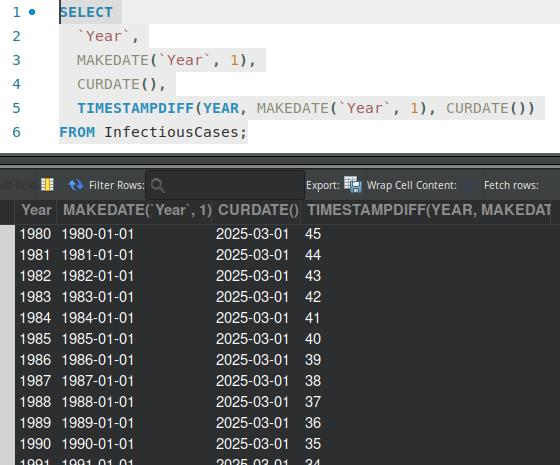
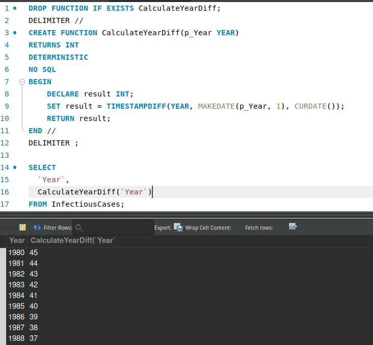

# goit-rdb-fp
Фінальний проєкт

## Завантаження даних

* Створіть схему pandemic у базі даних за допомогою SQL-команди.
```sql
CREATE SCHEMA IF NOT EXISTS `pandemic` DEFAULT CHARACTER SET utf8 ;

```
* Оберіть її як схему за замовчуванням за допомогою SQL-команди.
```sql
USE `pandemic`;

```
* Імпортуйте дані за допомогою Import wizard так, як ви вже робили це у темі 3.
```sql
select count(*) from infectious_cases;
```


* Продивіться дані, щоб бути у контексті.
Як бачите, атрибути Entity та Code постійно повторюються. Позбудьтеся цього за допомогою нормалізації даних.


## Нормалізуйте таблицю infectious_cases до 3ї нормальної форми. Збережіть у цій же схемі дві таблиці з нормалізованими даними.

* Аналіз даних за для нормалізації
```sql
with d as (
 select Entity, Code, count(*) AS cnt 
 from infectious_cases 
 group by 1,2
 )
select 
  count(*) AS all_uniq, 
  count(distinct Code) AS cnt_code, 
  sum(cnt) AS `all`
from d;
```


* **Висновок**:
  - пара Entity, Code - є унікальним ключем
  - Entity та Code - є унікальними значенням в парі

* Створення нормалізованих таблиць та наповнення даними
```sql
CREATE TABLE `Entities` (
  `id` INT NOT NULL AUTO_INCREMENT,
  `Name` VARCHAR(45) NOT NULL,
  `Code` VARCHAR(12) NOT NULL,
  PRIMARY KEY (`id`),
  UNIQUE INDEX `Code_UNIQUE` (`Code` ASC) VISIBLE);

CREATE TABLE `InfectiousCases` (
  `Entity_id` int NOT NULL,
  `Year` year DEFAULT NULL,
  `Number_yaws` text DEFAULT NULL,
  `polio_cases` int DEFAULT NULL,
  `cases_guinea_worm` int DEFAULT NULL,
  `Number_rabies` float DEFAULT NULL,
  `Number_malaria` float DEFAULT NULL,
  `Number_hiv` float DEFAULT NULL,
  `Number_tuberculosis` float DEFAULT NULL,
  `Number_smallpox` text DEFAULT NULL,
  `Number_cholera_cases` int DEFAULT NULL,
  KEY `fk_InfectiousCases_Entity_idx` (`Entity_id`),
  CONSTRAINT `fk_InfectiousCases_Entity` FOREIGN KEY (`Entity_id`) REFERENCES `Entities` (`id`) ON DELETE RESTRICT ON UPDATE CASCADE
) ENGINE=InnoDB DEFAULT CHARSET=utf8mb3;

INSERT INTO `Entities` (Name, Code) 
SELECT ic.Entity, ic.Code 
FROM infectious_cases AS ic
GROUP BY 1,2;

INSERT INTO `InfectiousCases` (
  Entity_id, 
  `Year`, Number_yaws, polio_cases, cases_guinea_worm,
  Number_rabies, Number_malaria, Number_hiv,
  Number_tuberculosis, Number_smallpox,
  Number_cholera_cases
  )
SELECT 
  (SELECT e.id FROM Entities AS e WHERE e.Code = ic.CODE),
  ic.Year, ic.Number_yaws, ic.polio_cases, ic.cases_guinea_worm,
  CASE WHEN ic.Number_rabies != '' THEN ic.Number_rabies ELSE NULL END, 
  CASE WHEN ic.Number_malaria != '' THEN ic.Number_malaria ELSE NULL END, 
  CASE WHEN ic.Number_hiv != '' THEN ic.Number_hiv ELSE NULL END,
  CASE WHEN ic.Number_tuberculosis != '' THEN ic.Number_tuberculosis ELSE NULL END, 
  ic.Number_smallpox,
  CASE WHEN ic.Number_cholera_cases != '' THEN ic.Number_cholera_cases ELSE NULL END
FROM infectious_cases AS ic;
```

## Проаналізуйте дані:
Для кожної унікальної комбінації Entity та Code або їх id порахуйте середнє, мінімальне, максимальне значення та суму для атрибута Number_rabies.
Результат відсортуйте за порахованим середнім значенням у порядку спадання.
Оберіть тільки 10 рядків для виведення на екран.

```sql
SELECT 
  Entity_id, AVG(Number_rabies), MIN(Number_rabies), MAX(Number_rabies), SUM(Number_rabies)
FROM InfectiousCases
WHERE Number_rabies IS NOT NULL
GROUP BY 1
ORDER BY 2
LIMIT 10;
```


## Побудуйте колонку різниці в роках.
Для оригінальної або нормованої таблиці для колонки Year побудуйте з використанням вбудованих SQL-функцій:
- атрибут, що створює дату першого січня відповідного року,
- атрибут, що дорівнює поточній даті,
- атрибут, що дорівнює різниці в роках двох вищезгаданих колонок.

```sql
SELECT
  `Year`,
  MAKEDATE(`Year`, 1),
  CURDATE(),
  TIMESTAMPDIFF(YEAR, MAKEDATE(`Year`, 1), CURDATE())
FROM InfectiousCases;
```


## Побудуйте власну функцію.
Створіть і використайте функцію, що будує такий же атрибут, як і в попередньому завданні: функція має приймати на вхід значення року, а повертати різницю в роках між поточною датою та датою, створеною з атрибута року (1996 рік → ‘1996-01-01’).

```sql
DROP FUNCTION IF EXISTS CalculateYearDiff;
DELIMITER //
CREATE FUNCTION CalculateYearDiff(p_Year YEAR)
RETURNS INT
DETERMINISTIC 
NO SQL
BEGIN
    DECLARE result INT;
    SET result = TIMESTAMPDIFF(YEAR, MAKEDATE(p_Year, 1), CURDATE());
    RETURN result;
END //
DELIMITER ;

SELECT
  `Year`,
  CalculateYearDiff(`Year`)
FROM InfectiousCases;
```

